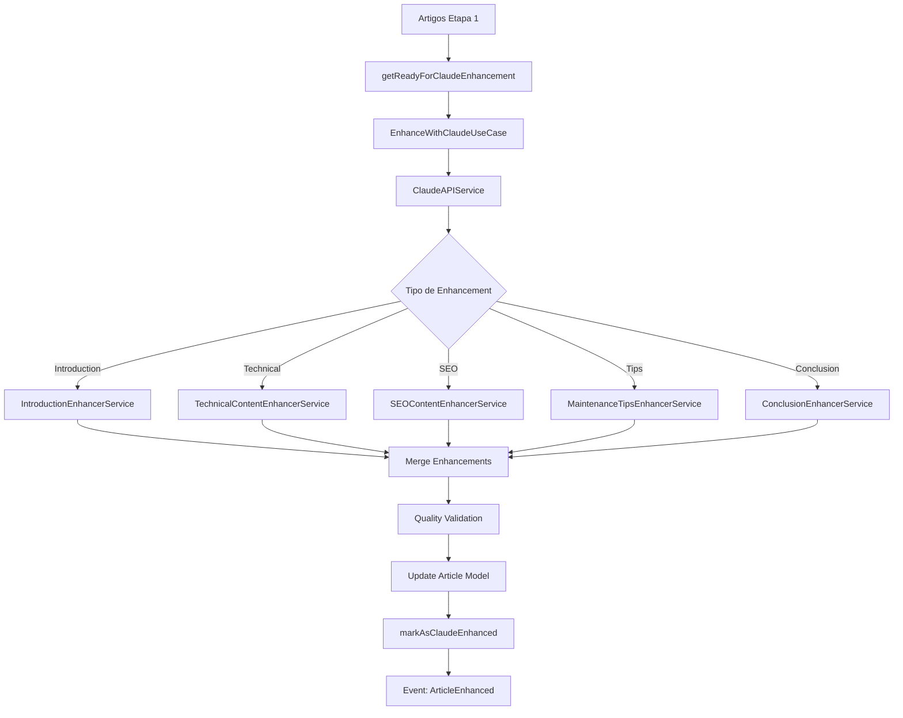

# 🤖 Sistema Quando Trocar Pneus - ETAPA 2: Claude API

> Refinamento automático de artigos usando Inteligência Artificial Claude para melhorar qualidade, SEO e engajamento.

## 📋 Índice

- [Visão Geral da Etapa 2](#-visão-geral-da-etapa-2)
- [Infraestrutura Preparada](#-infraestrutura-preparada)
- [Artefatos a Criar](#-artefatos-a-criar)
- [Fluxo de Refinamento](#-fluxo-de-refinamento)
- [Services de Enhancement](#-services-de-enhancement)
- [Commands da Etapa 2](#-commands-da-etapa-2)
- [Use Cases de Refinamento](#-use-cases-de-refinamento)
- [Configurações Claude](#-configurações-claude)
- [Tipos de Refinamento](#-tipos-de-refinamento)
- [Sistema de Controle](#-sistema-de-controle)
- [Integração com Etapa 1](#-integração-com-etapa-1)
- [Roadmap de Implementação](#-roadmap-de-implementação)

---

## 🎯 Visão Geral da Etapa 2

A **Etapa 2** transforma artigos básicos gerados na Etapa 1 em conteúdo **premium e envolvente** usando a API Claude. O sistema aplica refinamentos específicos em diferentes seções dos artigos, mantendo dados técnicos precisos enquanto melhora narrativa, SEO e engajamento.

### Objetivos Principais

- 🎨 **Melhorar narrativa** e fluidez dos textos
- 📈 **Otimizar SEO** com keywords naturais  
- 🔧 **Enriquecer conteúdo técnico** com explicações detalhadas
- 💡 **Adicionar insights** e dicas exclusivas
- 📚 **Expandir seções** com informações relevantes
- ✨ **Personalizar tom** por categoria de veículo

### Diferencial da Etapa 2

| Etapa 1 (Atual) | Etapa 2 (Claude) |
|------------------|-------------------|
| ✅ Dados técnicos corretos | ✅ Dados técnicos + narrativa envolvente |
| ✅ Estrutura completa | ✅ Estrutura + insights únicos |
| ✅ SEO básico | ✅ SEO avançado e natural |
| ✅ 1.800 palavras | ✅ 2.500+ palavras premium |
| ✅ Informativo | ✅ Informativo + engajante |

---

## 🏗️ Infraestrutura Preparada

### ✅ Já Implementado na Etapa 1

```php
// Model TireChangeArticle - Campos Claude
'claude_enhancements'        // JSON histórico de refinamentos
'claude_last_enhanced_at'    // Timestamp último refinamento
'claude_enhancement_count'   // Contador (máx 3 por artigo)

// Status de controle
'generation_status' // 'claude_enhanced', 'ready_for_transfer'

// Repository - Métodos prontos
getReadyForClaudeEnhancement()  // Buscar artigos prontos
markAsClaudeEnhanced()          // Marcar como refinado

// Events preparados
TireChangeArticleEnhanced       // Event para logging
LogArticleEnhanced             // Listener para logs

// Configurações Claude
config('when-to-change-tires.claude')  // Seção completa preparada
```

### ✅ Configurações Existentes

```env
# Claude API (já preparado)
TIRE_ARTICLES_CLAUDE_ENABLED=false
CLAUDE_API_KEY=your_claude_api_key_here
TIRE_ARTICLES_CLAUDE_MODEL=claude-sonnet-4-20250514
TIRE_ARTICLES_CLAUDE_MAX_TOKENS=4000
TIRE_ARTICLES_CLAUDE_TEMPERATURE=0.3
TIRE_ARTICLES_CLAUDE_MAX_ENHANCEMENTS=3
TIRE_ARTICLES_CLAUDE_DELAY=2
```

---

## 📦 Artefatos a Criar

### 1. 🔌 Core API Service

```php
// ClaudeAPIService.php
namespace Infrastructure\Services;

class ClaudeAPIService
{
    // Conexão com API Claude
    public function enhanceContent(string $prompt, array $options = []): array
    public function validateApiKey(): bool
    public function getUsageStats(): array
    public function handleRateLimit(): void
}
```

### 2. 🎨 Enhancement Services (5 services)

```php
// ArticleIntroductionEnhancerService.php
class ArticleIntroductionEnhancerService
{
    // Melhorar introduções com storytelling
    public function enhanceIntroduction(TireChangeArticle $article): string
}

// TechnicalContentEnhancerService.php  
class TechnicalContentEnhancerService
{
    // Enriquecer aspectos técnicos com explicações
    public function enhanceTechnicalSections(TireChangeArticle $article): array
}

// SEOContentEnhancerService.php
class SEOContentEnhancerService
{
    // Otimizar SEO naturalmente
    public function enhanceSEOElements(TireChangeArticle $article): array
}

// MaintenanceTipsEnhancerService.php
class MaintenanceTipsEnhancerService
{
    // Expandir dicas de manutenção
    public function enhanceMaintenanceTips(TireChangeArticle $article): array
}

// ConclusionEnhancerService.php
class ConclusionEnhancerService
{
    // Criar conclusões impactantes
    public function enhanceConclusion(TireChangeArticle $article): string
}
```

### 3. 🖥️ Commands da Etapa 2 (4 commands)

```php
// EnhanceArticlesWithClaudeCommand.php
class EnhanceArticlesWithClaudeCommand
{
    // Command principal para refinamento
    --batch-size=10              // Lote de refinamento
    --enhancement-type=all       // Tipo específico
    --filter-score=7.0          // Score mínimo
    --dry-run                   // Simular
}

// RefineSpecificSectionsCommand.php
class RefineSpecificSectionsCommand
{
    // Refinar seções específicas
    --section=introduction      // Seção específica
    --article-ids=1,2,3        // IDs específicos
}

// BatchClaudeEnhancementCommand.php
class BatchClaudeEnhancementCommand
{
    // Processamento em lotes otimizado
    --concurrent=3             // Requests paralelos
    --delay=2                  // Delay entre calls
}

// ClaudeQualityAnalysisCommand.php
class ClaudeQualityAnalysisCommand
{
    // Análise de qualidade dos refinamentos
    --compare-before-after     // Comparar versões
    --generate-report         // Relatório detalhado
}
```

### 4. 🎭 Use Cases de Refinamento (4 use cases)

```php
// EnhanceWithClaudeUseCase.php
class EnhanceWithClaudeUseCase
{
    // Caso de uso principal
    public function execute(EnhancementRequestDTO $request): EnhancementResultDTO
}

// RefineContentSectionsUseCase.php
class RefineContentSectionsUseCase
{
    // Refinamento por seções
    public function execute(array $sections, TireChangeArticle $article): array
}

// BatchEnhancementUseCase.php
class BatchEnhancementUseCase
{
    // Processamento em lotes
    public function execute(Collection $articles): BatchResultDTO
}

// QualityValidationUseCase.php
class QualityValidationUseCase
{
    // Validação de qualidade pós-refinamento
    public function execute(TireChangeArticle $article): ValidationResultDTO
}
```

### 5. 📄 DTOs Específicos (3 DTOs)

```php
// EnhancementRequestDTO.php
class EnhancementRequestDTO
{
    public readonly array $articleIds;
    public readonly string $enhancementType;
    public readonly array $options;
}

// EnhancementResultDTO.php
class EnhancementResultDTO
{
    public readonly bool $success;
    public readonly array $enhancedSections;
    public readonly float $qualityImprovement;
}

// ClaudeUsageStatsDTO.php
class ClaudeUsageStatsDTO
{
    public readonly int $totalRequests;
    public readonly int $tokensUsed;
    public readonly float $costEstimate;
}
```

---

## 🔄 Fluxo de Refinamento

### Processo Completo



### Etapas Detalhadas

1. **Seleção**: Buscar artigos com `generation_status = 'generated'`
2. **Preparação**: Extrair conteúdo e metadados
3. **Enhancement**: Aplicar refinamentos específicos
4. **Validação**: Verificar qualidade e consistência
5. **Merge**: Combinar refinamentos com conteúdo original
6. **Persistência**: Atualizar model com versão refinada
7. **Logging**: Registrar métricas e resultados

---

## 🎨 Services de Enhancement

### 1. ArticleIntroductionEnhancerService

**Objetivo**: Transformar introduções técnicas em narrativas envolventes

```php
// Prompt Claude para introduções
$prompt = "
Você é um redator automotivo especialista. Reescreva esta introdução sobre pneus 
do {$vehicle} para ser mais envolvente e storytelling, mantendo informações técnicas.

Introdução atual: {$currentIntro}

Diretrizes:
- Mantenha dados técnicos (pressões: {$pressures})  
- Use storytelling sutil
- Foque em segurança e economia
- Tom: informativo mas cativante
- Tamanho: 150-200 palavras
";
```

**Melhorias aplicadas:**
- ✨ Storytelling sutil
- 🎯 Hook inicial mais forte  
- 🔧 Integração natural de dados técnicos
- 📱 Linguagem mais próxima do leitor

### 2. TechnicalContentEnhancerService

**Objetivo**: Enriquecer explicações técnicas com detalhes e contexto

```php
// Áreas de enhancement técnico
- Explicação detalhada de pressões PSI
- Contexto sobre medidas de pneus  
- Detalhes sobre desgaste e manutenção
- Explicações sobre diferentes tipos de pneu
- Correlação entre dados técnicos
```

### 3. SEOContentEnhancerService

**Objetivo**: Otimizar SEO de forma natural e orgânica

```php
// Otimizações SEO
- Keywords naturais no texto
- Variações de long-tail keywords
- Meta descriptions mais atrativas
- H2/H3 tags otimizadas
- Internal linking suggestions
```

### 4. MaintenanceTipsEnhancerService

**Objetivo**: Expandir dicas com insights exclusivos e práticos

```php
// Expansão de dicas
- Dicas específicas por categoria de veículo
- Insights de economia (combustível/dinheiro)
- Alertas de segurança personalizados  
- Truques de manutenção caseira
- Quando procurar profissional
```

### 5. ConclusionEnhancerService

**Objetivo**: Criar conclusões que inspirem ação e retenham leitores

```php
// Elementos da conclusão melhorada
- Call-to-action claro
- Resumo dos pontos principais
- Incentivo à manutenção preventiva
- Link para artigos relacionados
- Reforço da importância da segurança
```

---

## 🖥️ Commands da Etapa 2

### EnhanceArticlesWithClaudeCommand

```bash
# Comando principal de refinamento
php artisan when-to-change-tires:enhance-with-claude

# Opções específicas
--batch-size=20                    # Processar 20 artigos por vez
--enhancement-type=introduction    # Apenas introduções
--filter-make=Honda               # Apenas Honda
--filter-score=7.0               # Score mínimo 7.0
--dry-run                        # Simular sem modificar
--concurrent=3                   # 3 requests paralelos
--verbose                        # Output detalhado

# Exemplos de uso
php artisan when-to-change-tires:enhance-with-claude --batch-size=10
php artisan when-to-change-tires:enhance-with-claude --enhancement-type=seo
php artisan when-to-change-tires:enhance-with-claude --filter-make=Honda --dry-run
```

### RefineSpecificSectionsCommand

```bash
# Refinar seções específicas
php artisan when-to-change-tires:refine-sections

# Opções
--section=introduction           # Seção específica
--section=technical             # Ou múltiplas seções
--article-ids=1,2,3,4          # IDs específicos
--all-sections                 # Todas as seções

# Exemplos
php artisan when-to-change-tires:refine-sections --section=introduction
php artisan when-to-change-tires:refine-sections --article-ids=1,2,3 --section=seo
```

### BatchClaudeEnhancementCommand

```bash
# Processamento otimizado em lotes
php artisan when-to-change-tires:batch-enhancement

# Opções de performance
--concurrent=5                  # Requests paralelos
--delay=1                      # Delay entre batches (segundos)
--chunk-size=25               # Tamanho do chunk
--retry-failed               # Reprocessar falhados
--priority=high              # Prioridade alta

# Exemplo para produção
php artisan when-to-change-tires:batch-enhancement \
  --concurrent=3 \
  --delay=2 \
  --chunk-size=20 \
  --retry-failed
```

### ClaudeQualityAnalysisCommand

```bash
# Análise de qualidade dos refinamentos
php artisan when-to-change-tires:claude-quality-analysis

# Opções de análise
--compare-before-after        # Comparar versões
--generate-report            # Relatório detalhado
--export-csv                # Exportar para CSV
--metrics=all               # Todas as métricas

# Exemplo de relatório completo
php artisan when-to-change-tires:claude-quality-analysis \
  --compare-before-after \
  --generate-report \
  --export-csv
```

---

## 🎭 Use Cases de Refinamento

### EnhanceWithClaudeUseCase

```php
class EnhanceWithClaudeUseCase
{
    public function execute(EnhancementRequestDTO $request): EnhancementResultDTO
    {
        // 1. Validar artigos elegíveis
        // 2. Preparar contexto para Claude
        // 3. Aplicar refinamentos por tipo
        // 4. Validar qualidade dos resultados
        // 5. Persistir melhorias
        // 6. Atualizar métricas
    }
}
```

### Fluxo de Refinamento

1. **Input Validation**: Verificar se artigos podem ser refinados
2. **Context Preparation**: Extrair dados do veículo e conteúdo atual
3. **API Calls**: Executar refinamentos via Claude API
4. **Quality Check**: Validar output contra critérios de qualidade
5. **Content Merge**: Integrar refinamentos ao conteúdo original
6. **Persistence**: Salvar versão refinada
7. **Metrics Update**: Atualizar estatísticas e scores

---

## ⚙️ Configurações Claude

### Variáveis de Ambiente

```env
# Ativar Etapa 2
TIRE_ARTICLES_CLAUDE_ENABLED=true

# Autenticação
CLAUDE_API_KEY=sk-ant-api03-xxxxx

# Modelo e Performance  
TIRE_ARTICLES_CLAUDE_MODEL=claude-sonnet-4-20250514
TIRE_ARTICLES_CLAUDE_MAX_TOKENS=4000
TIRE_ARTICLES_CLAUDE_TEMPERATURE=0.3

# Controle de Uso
TIRE_ARTICLES_CLAUDE_MAX_ENHANCEMENTS=3
TIRE_ARTICLES_CLAUDE_DELAY=2
TIRE_ARTICLES_CLAUDE_BATCH_SIZE=10
TIRE_ARTICLES_CLAUDE_CONCURRENT=3

# Rate Limiting
TIRE_ARTICLES_CLAUDE_REQUESTS_PER_MINUTE=50
TIRE_ARTICLES_CLAUDE_DAILY_TOKEN_LIMIT=100000

# Qualidade
TIRE_ARTICLES_CLAUDE_MIN_QUALITY_SCORE=7.5
TIRE_ARTICLES_CLAUDE_VALIDATE_OUTPUT=true
```

### Configuração por Tipo de Enhancement

```php
'enhancement_configs' => [
    'introduction' => [
        'max_tokens' => 800,
        'temperature' => 0.4,
        'target_words' => 200,
    ],
    'technical' => [
        'max_tokens' => 1200, 
        'temperature' => 0.2,
        'preserve_data' => true,
    ],
    'seo' => [
        'max_tokens' => 600,
        'temperature' => 0.3,
        'keyword_density' => 2.5,
    ],
    'maintenance' => [
        'max_tokens' => 1000,
        'temperature' => 0.3,
        'practical_focus' => true,
    ],
    'conclusion' => [
        'max_tokens' => 500,
        'temperature' => 0.4,
        'call_to_action' => true,
    ]
],
```

---

## 🎯 Tipos de Refinamento

### 1. Enhancement de Introdução

**Antes (Etapa 1):**
```text
O Honda Civic 2022 é um veículo que merece cuidados adequados com os pneus, 
componentes fundamentais para segurança, economia e desempenho...
```

**Depois (Etapa 2):**
```text
Imagine sair de casa numa manhã chuvosa e sentir seu Honda Civic 2022 deslizar 
ligeiramente numa curva que você faz há anos. Esse momento de apreensão pode ser 
o primeiro sinal de que seus pneus precisam de atenção. Mais do que simples 
borracha, os pneus são o elo vital entre seu Civic e o asfalto...
```

### 2. Enhancement Técnico

**Antes:**
```text
Pressão recomendada: 32/32 PSI
```

**Depois:**
```text
A pressão ideal de 32 PSI (tanto dianteiro quanto traseiro) foi meticulosamente 
calculada pelos engenheiros da Honda para seu Civic 2022. Essa precisão não é 
coincidência: cada PSI a mais ou a menos afeta diretamente o consumo de combustível, 
o desgaste dos pneus e, principalmente, sua segurança...
```

### 3. Enhancement SEO

**Antes:**
```text
Quando trocar os pneus do Honda Civic
```

**Depois:**
```text
Quando trocar os pneus do Honda Civic: 7 sinais que você não pode ignorar para 
manter segurança e economia
```

### 4. Enhancement de Manutenção

**Antes:**
```text
- Verifique a pressão mensalmente
```

**Depois:**
```text
- Verifique a pressão mensalmente, preferencialmente pela manhã antes de usar o 
  carro, quando os pneus estão frios. Use este truque profissional: mantenha um 
  calibrador digital no porta-luvas - a diferença de precisão pode economizar 
  até R$ 200 por ano em combustível...
```

---

## 🔧 Sistema de Controle

### Limites e Validações

```php
// Controles automáticos
class ClaudeEnhancementController
{
    // Máximo 3 refinamentos por artigo
    public function canEnhance(TireChangeArticle $article): bool
    
    // Rate limiting por minuto/dia  
    public function checkRateLimit(): bool
    
    // Validação de qualidade pós-refinamento
    public function validateEnhancement(string $original, string $enhanced): bool
    
    // Estimativa de custo
    public function estimateCost(array $articles): float
}
```

### Métricas de Qualidade

```php
// Validações automáticas
- Word count increase (mín +20%)
- Readability score maintenance  
- Technical data preservation (100%)
- SEO keywords natural integration
- Structural integrity check
- Content coherence validation
```

### Rollback System

```php
// Sistema de reversão
class EnhancementRollback
{
    // Reverter refinamento específico
    public function rollbackEnhancement(int $articleId, string $enhancementType): bool
    
    // Reverter para versão anterior
    public function rollbackToVersion(int $articleId, int $version): bool
    
    // Backup automático antes de refinamento
    public function createBackup(TireChangeArticle $article): string
}
```

---

## 🔗 Integração com Etapa 1

### Workflow Combinado

```bash
# 1. Gerar artigos básicos (Etapa 1)
php artisan when-to-change-tires:generate-initial-articles --batch-size=50

# 2. Aguardar conclusão e verificar
php artisan when-to-change-tires:import-vehicles --show-stats

# 3. Refinar com Claude (Etapa 2)  
php artisan when-to-change-tires:enhance-with-claude --batch-size=20

# 4. Análise de qualidade
php artisan when-to-change-tires:claude-quality-analysis --generate-report

# 5. Transferir artigos prontos
php artisan when-to-change-tires:transfer-to-wordpress
```

### Status de Artigos Expandido

| Status Etapa 1 | Status Etapa 2 | Descrição |
|----------------|----------------|-----------|
| `generated` | - | Pronto para refinamento |
| `generated` | `claude_enhanced` | Refinado pela IA |
| `claude_enhanced` | `ready_for_transfer` | Pronto para WordPress |
| `ready_for_transfer` | `transferred` | Enviado ao sistema final |

---

## 📅 Roadmap de Implementação

### Fase 1: Core Infrastructure (Semana 1)
- [ ] **ClaudeAPIService** - Conexão e autenticação
- [ ] **EnhancementRequestDTO/ResultDTO** - Estruturas de dados
- [ ] **EnhanceWithClaudeUseCase** - Caso de uso principal
- [ ] **Configurações** e validações

### Fase 2: Enhancement Services (Semana 2)  
- [ ] **ArticleIntroductionEnhancerService** - Melhorar introduções
- [ ] **TechnicalContentEnhancerService** - Enriquecer aspectos técnicos
- [ ] **SEOContentEnhancerService** - Otimizar SEO
- [ ] **Testes** e validações

### Fase 3: Commands e Automação (Semana 3)
- [ ] **EnhanceArticlesWithClaudeCommand** - Command principal
- [ ] **BatchClaudeEnhancementCommand** - Processamento otimizado
- [ ] **RefineSpecificSectionsCommand** - Refinamento granular
- [ ] **Scheduled tasks** automáticos

### Fase 4: Quality & Analytics (Semana 4)
- [ ] **MaintenanceTipsEnhancerService** - Expandir dicas
- [ ] **ConclusionEnhancerService** - Melhorar conclusões  
- [ ] **ClaudeQualityAnalysisCommand** - Análise de qualidade
- [ ] **Dashboard** e relatórios

### Fase 5: Production Ready (Semana 5)
- [ ] **Rate limiting** e controles
- [ ] **Error handling** robusto
- [ ] **Monitoring** e alertas
- [ ] **Documentation** e testes finais

---

## 🎯 Métricas de Sucesso

### Targets da Etapa 2

| Métrica | Etapa 1 | Target Etapa 2 |
|---------|---------|----------------|
| **Palavras por artigo** | 1.800 | 2.500+ |
| **Score de qualidade** | 7.0-8.0 | 8.5-9.5 |
| **Tempo de leitura** | 9 min | 12+ min |
| **Engajamento** | Básico | Alto |
| **SEO Keywords** | Básico | Otimizado |
| **Unicidade** | Template | Personalizado |

### ROI Esperado

- 📈 **+40% tempo no site** (artigos mais envolventes)
- 🎯 **+25% conversão** (CTAs otimizados)  
- 📊 **+60% keywords ranking** (SEO melhorado)
- 💰 **+30% valor por artigo** (qualidade premium)

---

## 🚀 Próximos Passos

### Para Iniciar Etapa 2:

1. **Configurar Claude API** - Obter API key e configurar
2. **Criar primeiro artefato** - ClaudeAPIService
3. **Implementar Use Case** - EnhanceWithClaudeUseCase  
4. **Testar com 1 artigo** - Validar fluxo completo
5. **Implementar Services** - Um enhancement por vez
6. **Criar Commands** - Interface de linha de comando
7. **Testes em lote** - Validar performance
8. **Deploy produção** - Com monitoramento

### Estimativa de Desenvolvimento

- **👨‍💻 Desenvolvedor**: 1 senior full-time
- **⏱️ Tempo**: 4-5 semanas  
- **🧪 Testes**: 1 semana adicional
- **📚 Documentação**: Paralelo ao desenvolvimento

---

## 💡 Considerações Finais

A **Etapa 2** representa um salto qualitativo significativo, transformando o sistema de um gerador de conteúdo técnico em uma **plataforma de conteúdo premium**. 

A infraestrutura já preparada na Etapa 1 garante uma **implementação suave e integrada**, mantendo a robustez arquitetural enquanto adiciona capabilities avançadas de IA.

**🎯 Resultado Final**: Sistema completo capaz de gerar automaticamente artigos de qualidade editorial premium, personalizados por veículo, com SEO otimizado e narrativa envolvente.

---

**🚀 Ready para revolucionar a geração de conteúdo automotivo!** 🤖✨