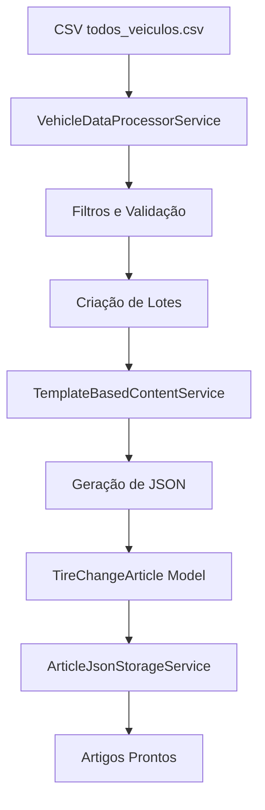

# 🚗 Sistema Quando Trocar Pneus - Documentação Completa

> Sistema automatizado para geração de artigos técnicos sobre "Quando Trocar Pneus" usando dados reais de veículos.

## 📋 Índice

-   [Visão Geral](#-visão-geral)
-   [Arquitetura](#-arquitetura)
-   [Instalação](#-instalação)
-   [Configuração](#-configuração)
-   [Comandos Disponíveis](#-comandos-disponíveis)
-   [Estrutura de Dados](#-estrutura-de-dados)
-   [Fluxo de Funcionamento](#-fluxo-de-funcionamento)
-   [Exemplos de Uso](#-exemplos-de-uso)
-   [Solução de Problemas](#-solução-de-problemas)
-   [Desenvolvimento](#-desenvolvimento)

## 🎯 Visão Geral

O **Sistema Quando Trocar Pneus** é um módulo Laravel DDD que automatiza a geração de artigos técnicos sobre manutenção de pneus para veículos específicos. O sistema processa dados reais de 965 veículos (carros e motocicletas) e gera conteúdo estruturado compatível com templates WordPress.

### Características Principais

-   ✅ **965 veículos reais** (carros e motocicletas)
-   ✅ **Dados técnicos precisos** (pressões, medidas, óleos)
-   ✅ **Compatibilidade total** com Template_Quando_Trocar_os_Pneus.blade.php
-   ✅ **Arquitetura DDD** robusta e escalável
-   ✅ **Geração em duas etapas** (inicial + refinamento Claude)
-   ✅ **Sistema de qualidade** automático
-   ✅ **Cache inteligente** e performance otimizada

### Tecnologias

-   **Laravel** 10+ (PHP 8.1+)
-   **Arquitetura DDD** (Domain Driven Design)
-   **MySQL** para persistência
-   **JSON** para estrutura de conteúdo
-   **Scheduled Tasks** para automação

---

## 🏗️ Arquitetura

### Estrutura DDD

```
src/ContentGeneration/WhenToChangeTires/
├── 📁 Domain/                   # Regras de negócio
│   ├── Entities/               # TireChangeArticle
│   ├── ValueObjects/           # VehicleData, TireChangeContent
│   ├── Services/               # Regras de domínio
│   └── Repositories/           # Interfaces
├── 📁 Infrastructure/          # Implementações técnicas
│   ├── Console/Commands/       # Artisan commands
│   ├── Services/               # Processamento e storage
│   ├── Repositories/           # Implementações
│   └── Providers/              # Injeção de dependência
└── 📁 Application/             # Casos de uso
    ├── UseCases/               # Lógica de aplicação
    ├── DTOs/                   # Transfer objects
    └── Services/               # Orquestração
```

### Componentes Principais

| Componente                      | Responsabilidade                |
| ------------------------------- | ------------------------------- |
| **TireChangeArticle**           | Model principal para artigos    |
| **VehicleDataProcessorService** | Importação e processamento CSV  |
| **TemplateBasedContentService** | Geração de conteúdo estruturado |
| **TireChangeArticleRepository** | Persistência com cache          |
| **ArticleJsonStorageService**   | Gerenciamento de JSONs          |

---

## 🚀 Instalação

### 1. Pré-requisitos

```bash
# Verificar versões
php --version    # >= 8.1
composer --version
```

### 2. Instalar Módulo

```bash
# Executar instalação completa
php artisan when-to-change-tires:install

# Ou instalar forçando sobrescrita
php artisan when-to-change-tires:install --force
```

### 3. Preparar Dados

```bash
# Colocar arquivo CSV na pasta correta
cp todos_veiculos.csv storage/app/

# Verificar estrutura do CSV
head -5 storage/app/todos_veiculos.csv
```

### 4. Executar Migrations

```bash
# Se não executou durante instalação
php artisan migrate
```

### 5. Verificar Instalação

```bash
# Testar importação
php artisan when-to-change-tires:import-vehicles --show-stats

# Verificar estrutura
php artisan list when-to-change-tires
```

---

## ⚙️ Configuração

### Arquivo .env

```env
# Módulo Quando Trocar Pneus
WHEN_TO_CHANGE_TIRES_ENABLED=true

# Configurações de Geração
TIRE_ARTICLES_BATCH_SIZE=50
TIRE_ARTICLES_MAX_RETRIES=3
TIRE_ARTICLES_TIMEOUT=300
TIRE_ARTICLES_MEMORY_LIMIT=512M

# Qualidade
TIRE_ARTICLES_MIN_WORDS=800
TIRE_ARTICLES_MIN_SCORE=6.0

# Armazenamento
TIRE_ARTICLES_JSON_PATH=articles/when-to-change-tires
TIRE_ARTICLES_BACKUP_ENABLED=true

# CSV
TIRE_ARTICLES_CSV_PATH=todos_veiculos.csv
TIRE_ARTICLES_CSV_ENCODING=UTF-8

# Cache
TIRE_ARTICLES_CACHE_ENABLED=true
TIRE_ARTICLES_CACHE_STATS_TTL=1800

# Logs
TIRE_ARTICLES_LOGGING_ENABLED=true
TIRE_ARTICLES_LOG_LEVEL=info

# Scheduled Tasks
TIRE_ARTICLES_AUTO_GENERATION=false
TIRE_ARTICLES_AUTO_CLEANUP=true

# SEO
TIRE_ARTICLES_BASE_URL=https://mercadoveiculos.com
TIRE_ARTICLES_URL_PREFIX=info/quando-trocar-pneus

# Claude API (Etapa 2 - Futuro)
TIRE_ARTICLES_CLAUDE_ENABLED=false
CLAUDE_API_KEY=your_claude_api_key_here
```

### Arquivo de Configuração

```php
// config/when-to-change-tires.php
return [
    'enabled' => env('WHEN_TO_CHANGE_TIRES_ENABLED', true),
    'generation' => [
        'batch_size' => env('TIRE_ARTICLES_BATCH_SIZE', 50),
        'timeout' => env('TIRE_ARTICLES_TIMEOUT', 300),
    ],
    // ... outras configurações
];
```

---

## 🖥️ Comandos Disponíveis

### 📥 Importação e Validação

```bash
# Importar veículos do CSV com estatísticas
php artisan when-to-change-tires:import-vehicles --show-stats

# Importar apenas Honda
php artisan when-to-change-tires:import-vehicles --filter-make=Honda

# Importar apenas motocicletas
php artisan when-to-change-tires:import-vehicles --filter-vehicle-type=motorcycle

# Validar dados sem processar
php artisan when-to-change-tires:import-vehicles --validate-only

# Filtrar por anos
php artisan when-to-change-tires:import-vehicles --year-from=2020 --year-to=2024
```

### 🔄 Geração de Artigos

```bash
# Gerar todos os artigos
php artisan when-to-change-tires:generate-initial-articles

# Gerar com filtros específicos
php artisan when-to-change-tires:generate-initial-articles --filter-make=Honda
php artisan when-to-change-tires:generate-initial-articles --filter-category=hatch
php artisan when-to-change-tires:generate-initial-articles --filter-vehicle-type=motorcycle

# Controles de execução
php artisan when-to-change-tires:generate-initial-articles --batch-size=20
php artisan when-to-change-tires:generate-initial-articles --dry-run
php artisan when-to-change-tires:generate-initial-articles --show-progress
php artisan when-to-change-tires:generate-initial-articles --only-json
php artisan when-to-change-tires:generate-initial-articles --overwrite

# Filtros por ano
php artisan when-to-change-tires:generate-initial-articles --year-from=2020 --year-to=2024
```

### 📦 Processamento de Lotes

```bash
# Processar lote específico
php artisan when-to-change-tires:process-batch batch_20250628_001

# Forçar processamento
php artisan when-to-change-tires:process-batch batch_20250628_001 --force

# Apenas JSONs
php artisan when-to-change-tires:process-batch batch_20250628_001 --only-json
```

### 🛠️ Instalação e Manutenção

```bash
# Instalação completa
php artisan when-to-change-tires:install

# Reinstalar forçando
php artisan when-to-change-tires:install --force
```

---

## 📊 Estrutura de Dados

### CSV de Entrada (todos_veiculos.csv)

```csv
make,model,year,tire_size,pressure_empty_front,pressure_empty_rear,pressure_light_front,pressure_light_rear,pressure_max_front,pressure_max_rear,pressure_spare,category,recommended_oil
Honda,Civic,2022,215/55 R17,32,32,34,34,36,36,35,sedan,0W20 Sintético
Honda,Bros 160,2022,90/90-19 (dianteiro) 110/90-17 (traseiro),29,33,31,35,35,37,35,motorcycle_trail,10W30 Semissintético
```

### Model TireChangeArticle

```php
// Campos principais
'make', 'model', 'year'              // Identificação do veículo
'tire_size'                          // Medida dos pneus
'pressure_empty_front/rear'          // Pressões veículo vazio
'pressure_light_front/rear'          // Pressões com carga
'pressure_max_front/rear'            // Pressões máximas
'category'                           // Categoria (hatch, sedan, motorcycle_*)
'recommended_oil'                    // Óleo recomendado

// Conteúdo e metadados
'title', 'slug'                      // SEO
'article_content'                    // JSON estruturado
'meta_description', 'seo_keywords'   // SEO
'wordpress_url', 'canonical_url'     // URLs

// Controle de qualidade
'generation_status'                  // pending, generated, claude_enhanced
'content_score'                      // 1-10 (automático)
'quality_checked'                    // boolean
'batch_id'                          // Identificação do lote
```

### JSON de Saída

```json
{
    "title": "Quando Trocar os Pneus do Honda Civic 2022 - Guia Completo",
    "slug": "quando-trocar-pneus-honda-civic-2022",
    "template": "when_to_change_tires",
    "content": {
        "introducao": "Identificar o momento certo para trocar...",
        "sintomas_desgaste": {
            "vibracao_direcao": {
                "titulo": "Vibração na Direção",
                "severidade": "alta"
            }
        },
        "fatores_durabilidade": {
            "calibragem_inadequada": {
                "impacto_negativo": "-30%"
            }
        },
        "cronograma_verificacao": {
            "quinzenal": {
                "titulo": "Verificação Quinzenal"
            }
        },
        "tipos_pneus": {
            "original_oem": {
                "quilometragem_esperada": "50.000 - 60.000 km"
            }
        },
        "vehicle_data": {
            "pressure_display": "32/32 PSI",
            "tire_size": "215/55 R17"
        }
    },
    "seo_data": {
        "page_title": "Quando Trocar os Pneus do Honda Civic 2022",
        "meta_description": "Guia completo sobre quando trocar...",
        "h2_tags": ["Sintomas de Pneus", "Fatores de Durabilidade"]
    },
    "vehicle_info": {
        "make": "Honda",
        "model": "Civic",
        "year": "2022"
    }
}
```

---

## 🔄 Fluxo de Funcionamento

### Etapa 1: Geração Inicial



### Processo Detalhado

1. **Importação**: CSV → VehicleData objects
2. **Filtros**: Aplicar critérios (marca, categoria, ano)
3. **Validação**: Verificar dados obrigatórios
4. **Lotes**: Dividir em grupos processáveis
5. **Geração**: Criar conteúdo estruturado
6. **Persistência**: Salvar JSON + Model
7. **Quality Score**: Calcular pontuação automática

### Status de Artigos

| Status               | Descrição                  |
| -------------------- | -------------------------- |
| `pending`            | Aguardando processamento   |
| `generated`          | Artigo inicial criado      |
| `claude_enhanced`    | Refinado pela IA (Etapa 2) |
| `ready_for_transfer` | Pronto para WordPress      |
| `transferred`        | Enviado para sistema final |
| `published`          | Publicado no site          |
| `error`              | Erro durante processamento |

---

## 📝 Exemplos de Uso

### Cenário 1: Gerar Artigos para Honda

```bash
# 1. Verificar quantos veículos Honda existem
php artisan when-to-change-tires:import-vehicles --filter-make=Honda --show-stats

# 2. Gerar apenas artigos Honda em lotes pequenos
php artisan when-to-change-tires:generate-initial-articles \
  --filter-make=Honda \
  --batch-size=10 \
  --show-progress

# 3. Verificar resultados
ls storage/app/articles/when-to-change-tires/ | grep honda | wc -l
```

### Cenário 2: Testar com Motocicletas

```bash
# 1. Simular geração de motocicletas
php artisan when-to-change-tires:generate-initial-articles \
  --filter-vehicle-type=motorcycle \
  --batch-size=5 \
  --dry-run

# 2. Gerar realmente se simulação OK
php artisan when-to-change-tires:generate-initial-articles \
  --filter-vehicle-type=motorcycle \
  --batch-size=5
```

### Cenário 3: Geração Completa

```bash
# 1. Validar todos os dados primeiro
php artisan when-to-change-tires:import-vehicles --validate-only --show-stats

# 2. Gerar todos os artigos em lotes maiores
php artisan when-to-change-tires:generate-initial-articles \
  --batch-size=50 \
  --show-progress

# 3. Verificar estatísticas finais
mysql -e "SELECT generation_status, COUNT(*) FROM tire_change_articles GROUP BY generation_status;"
```

### Cenário 4: Desenvolvimento e Debug

```bash
# 1. Gerar apenas 1 artigo para testar
php artisan when-to-change-tires:generate-initial-articles \
  --filter-make=Honda \
  --batch-size=1 \
  --verbose

# 2. Verificar logs detalhados
tail -f storage/logs/laravel.log | grep "tire"

# 3. Inspecionar JSON gerado
cat storage/app/articles/when-to-change-tires/quando-trocar-pneus-honda-civic-2022.json | jq .
```

---

## 🛠️ Solução de Problemas

### Problemas Comuns

#### ❌ Erro: "CSV não encontrado"

```bash
# Verificar localização
ls -la storage/app/todos_veiculos.csv

# Copiar se necessário
cp /path/to/todos_veiculos.csv storage/app/
```

#### ❌ Erro: "Memory limit exceeded"

```bash
# Aumentar memória no .env
TIRE_ARTICLES_MEMORY_LIMIT=1024M

# Ou reduzir batch size
php artisan when-to-change-tires:generate-initial-articles --batch-size=10
```

#### ❌ Erro: "Class not found"

```bash
# Limpar cache
php artisan cache:clear
php artisan config:clear
composer dump-autoload
```

#### ❌ Erro: "Métodos duplicados"

```bash
# Usar versão corrigida do TemplateBasedContentService
# Substituir pelo arquivo corrigido fornecido
```

### Debug e Logs

```bash
# Ativar logs detalhados
export TIRE_ARTICLES_LOG_LEVEL=debug

# Verificar logs em tempo real
tail -f storage/logs/laravel.log

# Verificar tabela de artigos
mysql -e "SELECT COUNT(*), generation_status FROM tire_change_articles GROUP BY generation_status;"

# Verificar arquivos JSON
find storage/app/articles/when-to-change-tires/ -name "*.json" | wc -l
```

### Performance

```bash
# Verificar uso de memória
php artisan when-to-change-tires:generate-initial-articles --dry-run | grep -i memory

# Otimizar batch size
php artisan when-to-change-tires:generate-initial-articles --batch-size=25

# Ativar cache
export TIRE_ARTICLES_CACHE_ENABLED=true
```

---

## 🚀 Desenvolvimento

### Estrutura para Novos Features

```php
// 1. Criar novo ValueObject
namespace Domain\ValueObjects;
class NewFeatureData { ... }

// 2. Adicionar método no Service
class TemplateBasedContentService {
    protected function generateNewFeature(VehicleData $vehicle): array {
        // Implementação
    }
}

// 3. Atualizar estrutura JSON
protected function generateContentStructure(VehicleData $vehicle): array {
    return [
        'introducao' => $this->generateIntroduction($vehicle),
        'new_feature' => $this->generateNewFeature($vehicle), // Nova seção
        // ... outras seções
    ];
}
```

### Adicionando Novos Filtros

```php
// VehicleDataProcessorService
public function filterVehicles(Collection $vehicles, array $criteria): Collection {
    return $vehicles->filter(function (VehicleData $vehicle) use ($criteria) {
        // Adicionar novo filtro
        if (!empty($criteria['new_filter'])) {
            if ($vehicle->someProperty !== $criteria['new_filter']) {
                return false;
            }
        }
        // ... outros filtros
    });
}
```

### Testes

```bash
# Executar testes do módulo
php artisan test --filter="WhenToChangeTires"

# Teste específico
php artisan test tests/Unit/WhenToChangeTires/VehicleDataProcessorServiceTest.php
```

### Contribuindo

1. **Fork** do repositório
2. **Criar branch** para feature: `git checkout -b feature/nova-funcionalidade`
3. **Fazer commit**: `git commit -am 'Adiciona nova funcionalidade'`
4. **Push** para branch: `git push origin feature/nova-funcionalidade`
5. **Criar Pull Request**

---

## 📈 Métricas e Monitoramento

### Estatísticas do Sistema

```bash
# Dashboard completo
php artisan tinker
>>> app(\Src\ContentGeneration\WhenToChangeTires\Infrastructure\Services\TireChangeArticleService::class)->getDashboardStats()

# Estatísticas específicas
>>> app(\Src\ContentGeneration\WhenToChangeTires\Infrastructure\Repositories\TireChangeArticleRepository::class)->getStatistics()
```

### Dados Esperados

| Métrica                | Valor Esperado |
| ---------------------- | -------------- |
| **Total de Veículos**  | 965            |
| **Carros**             | 391            |
| **Motocicletas**       | 410            |
| **Elétricos/Híbridos** | 164            |
| **Marcas**             | 25+            |
| **Anos**               | 2019-2025      |

### Qualidade dos Artigos

| Score    | Descrição                                      |
| -------- | ---------------------------------------------- |
| 9.0-10.0 | Excelente (>2000 palavras, estrutura completa) |
| 8.0-8.9  | Muito Bom (1500-2000 palavras)                 |
| 7.0-7.9  | Bom (1000-1500 palavras)                       |
| 6.0-6.9  | Adequado (800-1000 palavras)                   |
| <6.0     | Precisa melhorar                               |

---

## 🔮 Roadmap (Etapa 2)

### Claude API Integration

-   ✅ **Infraestrutura preparada** (campos na model, configurações)
-   🔄 **Em desenvolvimento**: Services de refinamento
-   📋 **Planejado**: Commands de enhancement
-   🎯 **Futuro**: Automação completa

### Features Futuras

-   📊 **Dashboard Web** para monitoramento
-   🔄 **API REST** para integração externa
-   📱 **Notificações** por email/Slack
-   🔍 **Busca avançada** de artigos
-   📈 **Analytics** de performance

---

## 📞 Suporte

### Documentação

-   **README**: Este arquivo
-   **Config**: `config/when-to-change-tires.php`
-   **Commands**: `php artisan list when-to-change-tires`

### Logs

```bash
# Logs do sistema
tail -f storage/logs/laravel.log | grep "WhenToChangeTires"

# Logs específicos (se configurado)
tail -f storage/logs/tire-articles.log
```

### Contato

-   **Issues**: Criar issue no repositório
-   **Features**: Pull request com documentação
-   **Dúvidas**: Verificar logs e documentação primeiro

---

## 📜 Licença

Este projeto está licenciado sob a [MIT License](LICENSE).

---

## 🙏 Agradecimentos

-   **Laravel Framework** pela base sólida
-   **DDD Architecture** pelos padrões de organização
-   **Claude AI** pela futura integração de refinamento

---

**🎉 Sistema pronto para uso! Boa geração de artigos!** 🚀
